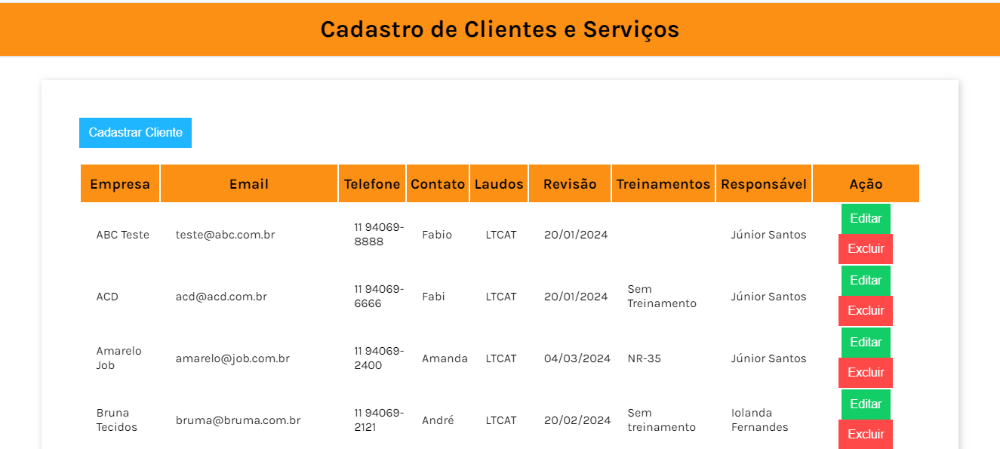
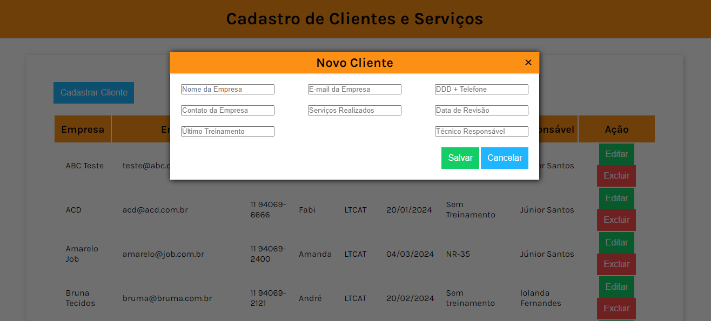
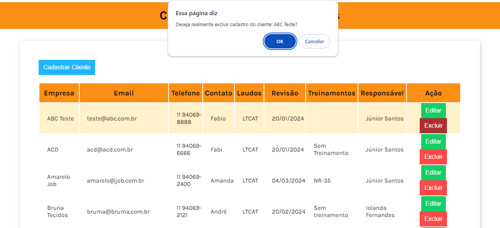
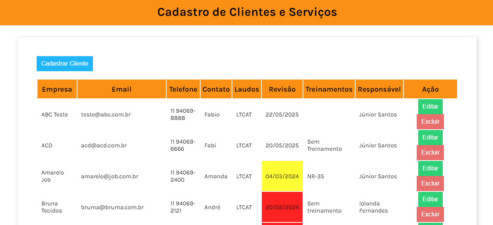

# CRUD - Para cadastro de clientes e serviços.

#### Projeto desenvolvido para controle de clientes e serviços da Empresa (JAS Assessoria em Segurança do Trabalho).

##### A proposta foi desenvolver um CRUD utilizando as tecnologias HTML, CSS e JavaScript, com isso proporcionar uma melhor administração dos clientes e serviços realizados.

## Segue abaixo layout da aplicação:

## Projeto criado por:

---

## Contato

## Linguagens

